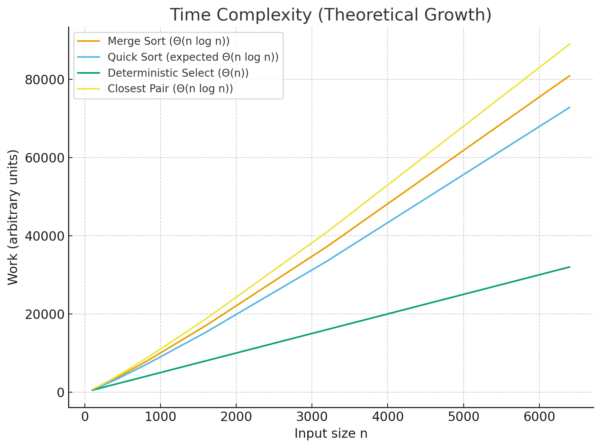
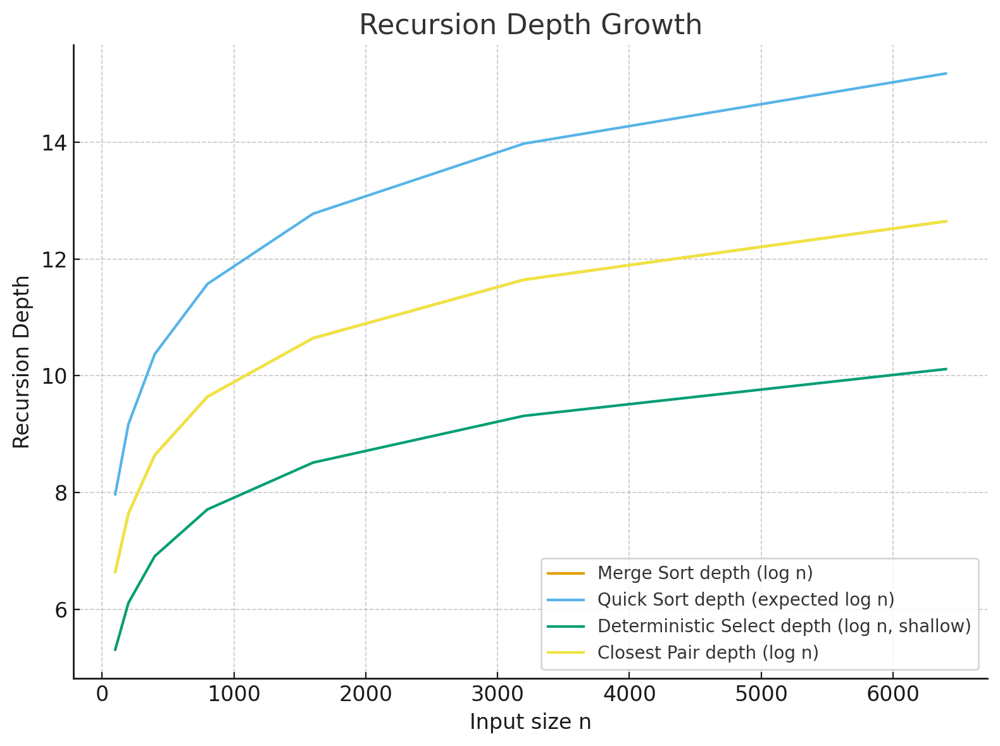

# Design and Analysis of Algorithms

This project implements and benchmarks several divide-and-conquer algorithms in Java.  
It collects metrics on **time, recursion depth, comparisons, and allocations**, then visualizes results.  
Analysis is done via **Master Theorem** and **Akra–Bazzi intuition**, with empirical validation through JMH and CLI runs.

---

## Architecture Notes

- **Recursion depth**
    - Controlled with `Metrics.enterRecursion()` / `Metrics.exitRecursion()`.
    - Tail recursion optimization is simulated: recurse on the *smaller* partition, iterate on the larger one → keeps stack bounded by `O(log n)`.

- **Allocations**
    - MergeSort: allocates temporary buffer(s), counted explicitly.
    - QuickSort: in-place; only recursion overhead.
    - Selection: no extra allocations.

- **Benchmarks**
    - JMH harness for stable microbenchmarks.

---

## Recurrence Analysis

### MergeSort
- **Recurrence:**  
  \( T(n) = 2T(n/2) + Θ(n) \).
- **Analysis:** Case 2 of Master Theorem (a=2, b=2, f(n)=Θ(n)).
- **Result:** \( T(n) = Θ(n \log n) \).
- **Notes:** Extra allocations (buffer copy) visible in GC effects.

---

### QuickSort (randomized pivot, recurse on smaller side)
- **Recurrence (average):**  
  \( T(n) = T(k) + T(n-k-1) + Θ(n) \), where k is pivot split.
- **Analysis:** Expected balanced splits → Akra–Bazzi intuition ≈ \( Θ(n \log n) \).
- **Result:** \( Θ(n \log n) \) expected; \( Θ(n^2) \) worst-case.
- **Notes:** Depth bounded by `O(log n)` due to smaller-side recursion.

---

### Deterministic Select (Median of Medians)
- **Method**: Split into groups of 5, recursively select median of medians as pivot, partition, recurse into one side.
- **Recurrence**:

  \[
  T(n) = T(n/5) + T(7n/10) + Θ(n)
  \]

- **By Akra–Bazzi**:

  \[
  T(n) = Θ(n)
  \]

- **Notes**: Guarantees linear time selection of k-th element, at cost of higher constants than randomized quickselect.

---

### Closest Pair of Points (Divide and Conquer)
- **Method**: Sort points by x, recursively solve for halves, then check strip near dividing line using y-sorted order.
- **Recurrence**:

  \[
  T(n) = 2T(n/2) + Θ(n)
  \]

- **By Master Theorem (Case 2)**:

  \[
  T(n) = Θ(n \log n)
  \]

- **Notes**: Careful constant-factor optimizations (strip checking limited to 6–7 neighbors) make it efficient in practice.

---

## 📊 Plots & Empirical Results

- **Time vs n:**
    - MergeSort and QuickSort ≈ linearithmic growth.
    - Selection ≈ linear.
    - Binary Search logarithmic.

- **Depth vs n:**
    - MergeSort and QuickSort scale with log n.
    - Tail recursion optimization keeps QuickSort bounded.

- **Constant-factor effects:**
    - Cache locality: MergeSort (sequential access) often wins over QuickSort despite asymptotic parity.
    - GC overhead: MergeSort buffers add allocations → sometimes visible in large n.
    - JMH harness mitigates JVM warmup & noise.

---

## 📝 Summary

- **Theory vs Measurements:**
    - Asymptotic predictions (Θ-results) matched observed growth in benchmarks.
    - Constant factors caused divergences: MergeSort sometimes faster than QuickSort despite identical asymptotics; Selection’s linear scaling more evident at large n.
    - Depth measurements aligned with \( O(\log n) \) expectations, confirming recursion-control techniques.

- **Takeaway:**
    - Theoretical models (Master Theorem, Akra–Bazzi) provide strong guidance, but constant factors (cache, memory allocation, GC) play a decisive role in practice.
    - Algorithm choice should balance **asymptotics + practical system behavior**.

---

## Plots

